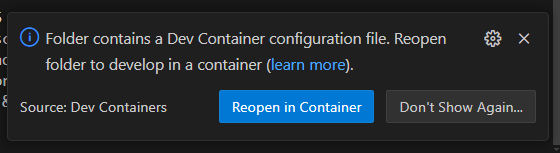
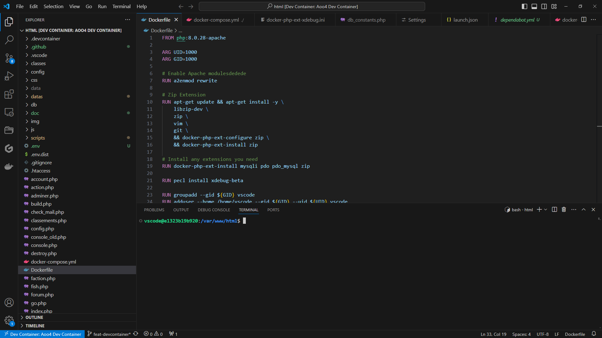
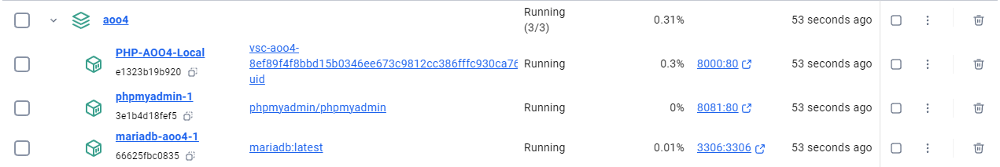
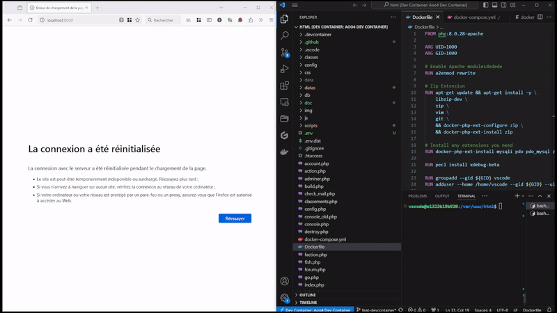
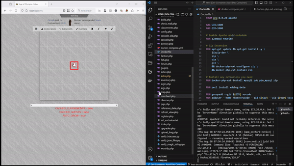

# Age of Olympia v4

Dans cette première page se trouve la documentation pour lancer le projet.
Pour l'architecture du code, il faut suivre ce lien :
[Architecture du code](docs/architecture.md)

## Démarrage de l'environnement de développement

L'environnement de développement est un devcontainer. Le devcontainer est une fonctionnalité proposée par vscode, il est donc recommandé d'utiliser vscode pour travailler sur ce projet.

### Pré-requis

Pour que l'environnement fonctionne correctement, il faut installer les pré-requis suivants :

- [Docker](https://docs.docker.com/engine/install/)
- [VsCode](https://code.visualstudio.com/) avec l'extension [Dev Containers](https://marketplace.visualstudio.com/items?itemName=ms-vscode-remote.remote-containers)

### Démarrage

Une fois ce dépôt cloné, le fait de l'ouvrir dans vscode devrait ouvrir le pop-up suivant : 



En cliquant sur ce bouton, VsCode va redémarrer et builder l'image Docker qui contiendra l'environnement de développement.

Cette image peut-être un peu longue à construire la première fois, n'hésitez pas à afficher les logs, ça occupe !

A la fin de la construction, le devcontainer va lancer les commandes de base pour télécharger les ressources néssaires, en particulier `composer install`.

Une fois que c'est fait, on se retrouve dans la fenêtre suivante :



Vous pouvez alors vérifier que trois conteneurs sont démarrés, par exemple ici avec Docker Desktop : 



C'est presque prêt !

dupliquez le fichier "config/db_constants.php.exemple" vers "config/db_constants.php"

et mettez le contenu suivant : 

```code
define('DB_CONSTANTS', array(
    'host'=>"mariadb-aoo4:3306",
    'user'=>"root",
    'psw'=>"passwordRoot",
    'db'=>"aoo4",
    'password'=>"passwordRoot",
    'dbname'=>"aoo4",
    'driver' => 'pdo_mysql',
));
```
sauvegardez et vous être prêt ! 

### Lancement du serveur

Il ne reste plus qu'à démarrer le serveur : 

```shell
apache2-foreground
```

Voici le résultat attendu : 



Attention, il exite un bug dans apache qui fait que le serveur d'arrête avec le signal SIGWINCH lorsque l'on redimensionne la fenêtre du terminal. Il suffit alors de le relancer.

### Debug

Une fois le serveur lancé, on n'a plus qu'à lancer le debuggueur et on a alors accès au pas à pas et à l'observation des valeurs des variables.

Pour lancer le debuggeur, il suffit de se rendre dans la section "Run and Debug" à gauche, puis de choisir la cible "Listen for Xdebug".

Une fois que c'est fait, on peut mettre un point d'arrêt et observer le résultat d'un appel.



### Modification de l'environnement de travail

Il est évidemment possible de modifier l'environnement de travail en modifiant les fichiers situés dans le dossier `.devcontainer`.

Une fois que c'est fait, il faut alors reconstruire le devcontainer : il faut appuyer sur F1 puis taper "Dev Container" dans le moteur de recherche, les différentes commandes, dont celles de reconstruction, apparaîtront.

### Premiers pas sur le jeu

Pour pouvoir lancer le jeu, il faut utiliser le fichier sql `db/init_noupdates.sql` pour peupler la base.

Ensuite il faut dézipper le fichier `datas/private/players.zip` là où il se trouve, cala va créer un certain nombre de fichiers dans le dossier `players`.

Ces deux actions vont entre autre créer trois personnages : 

- Cradek, matricule 1, Nain, administrateur
- Dorna, matricule 2, Nain, joueur
- Thyrias, matricule 3, Elfe, joueur

Pour s'y connecter, le mot de passe est `test`.

Pour ouvrir la console d'administration il faut utiliser ² une fois connecté.
