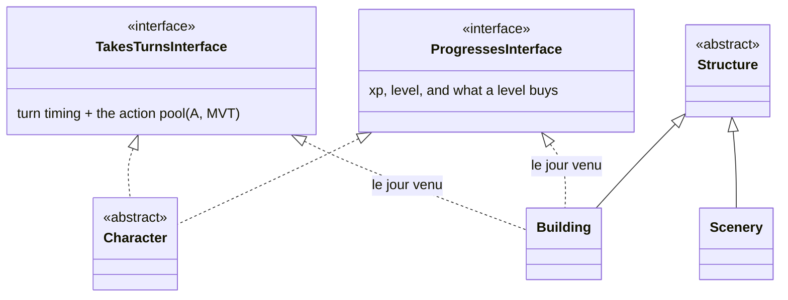

# Design — A building that plays

**Status**: decisions taken, **nothing to build yet**
**Date**: 2026-08-02
**Purpose**: buildings will be playable and will level up. This note records what was decided
so that today's code does not close the door — it is *not* a build order.

Companion of [entity-system-overview.md](entity-system-overview.md) (the state as delivered),
[design-buildings-entities.md](design-buildings-entities.md) and
[design-vie-et-contenance.md](design-vie-et-contenance.md), whose "capability, not a place in
the tree" is the pattern applied here.

---

## 1. The decision, in one paragraph

A playable building is **an entity that acts**, not a character. It keeps its branch —
`Structure` — and gains two capabilities that `Character` happens to have first:
**taking turns** and **progressing**. It never gains an account. Whoever drives it, the
action points belong to the building: spent is spent.

---

## 2. What was actually asked of the tree

`Character` is STI on the same `players` table, so a building row already *has* `xp`, `rank`,
`nextTurnTime`, `lastActionTime`. Nothing needs to move for the data to exist. What is
missing is a contract. Sorted by what a building can honestly carry:

| group | fields | for a building |
|---|---|---|
| **account** | `psw`, `mail`, `plainMail`, `emailBonus`, `lastLoginTime` | **never** — and it is already slated to leave `Character` for its own table |
| **person** | `story`, `quest`, `godId`, `pf`, `secretFaction*`, `malus` | no — `put_malus()` already early-returns on structures |
| **playing** | `nextTurnTime`, `lastActionTime`, `nextTurnRescheduled`, `antiBerserkTime` | **yes** |
| **progressing** | `xp`, `rank`, `bonusPoints`, `pi` | **yes** |

Two capabilities, ~8 fields. That is the whole ask, and none of it is character-ish by
nature.

`pi` belongs with progression, not beside gold: `Player::put_xp()` mints it in the same
statement as experience, capped at the season's XP ceiling, and characteristic upgrades spend
it. Gold is an item; PI is the currency progression itself produces, so the loop is one
thing — XP raises the rank and mints PI, PI buys upgrades, and the season's overflow XP is
banked into `bonus_points`.

What *is* a separate question: whether a playable building spends PI to raise its own
characteristics. That is plausibly the heart of building evolution, but it asks who **uses**
the capability, not where the column lives.

**The tree does not move.** No reparenting under `Character` (it would drag in the account,
the enfers death path, missives, faction-membership counting, dodge and malus — every branch
behaviour that is *right* today for a structure, and `EntityCategory` gates a dozen of them
at once). No third level either: the rule stands, and it would fork again the day something
else wants a turn.

`races.playable` stays on the **trunk** rather than descending to `CharacterRace`. That call
was made before this one and is now load-bearing: it is the flag by which a building type
opts into playing.

---

## 3. Decisions worth being unable to forget

### 3.1 The building earns its own XP, and keeps it in the void

Progression belongs to the entity, not to its faction and not to the tile. There is a plan
for building evolution behind this; what matters structurally is the consequence:

**A destroyed building keeps its level.** That already works, by accident of a decision taken
for another reason: `vanish()` does not delete the row — it shelves it (`coords_id` and
`holder_id` NULL, cells removed) so that logs keep their targets and ids are never recycled.
The level survives there, in the void, with the row.

> **Door-keeping rule**: progression must live in **columns or a satellite of its own** —
> never in `players_bonus`. `vanish()` deletes `players_bonus`, `players_effects` and
> `players_items` for the entity; anything filed there is wiped on destruction. Life is a
> deficit and *should* be wiped. A level must not be.

### 3.2 The pool belongs to the building — spent is spent

If a building can attack, it has its own action points. Whoever spends them — the owner, a
faction member, another member a minute later — they are gone until its next turn. **No
per-member quota**, no share-out: one pool, one entity.

> **Door-keeping rule**: that makes every spend a **shared** check-then-act. Two members
> acting at the same instant must not both spend the last point. The pattern is settled in
> this codebase: conditional `UPDATE … WHERE <still available>` plus an affected-rows check,
> never read-then-write. Same shape as the gold spend path.

### 3.3 Movement stays in the capability

A building does not move — until it does. Siege engines are literally moving buildings, so
`TakesTurns` keeps **A and MVT together** rather than splitting into a "static actor" and a
"mobile actor". An immobile building simply never spends MVT; nothing about the capability
says it must.

### 3.4 Who drives it is a question already answered

Turn processing is **session-driven** today: `TurnProcessingService::processIfDue()` gates on
`$_SESSION['playerId']`, plus a tutorial check and an admin flag. A building has no session,
so it needs a **controller, not an account** — the faction screen.

And "who may act with this thing" is a rule that already exists:
`LockService::mayLock()` — the owner, or a member of its faction, and a thing with neither
owner nor faction belongs to everyone. Reuse it rather than growing a second answer.

> **Door-keeping rule**: keep session and tutorial gating **out of the turn computation**.
> They are already tangled in `processIfDue()`; do not add to it. The day a building takes a
> turn, what fires it is being *touched* — its screen opened, an action attempted with it —
> exactly as lazily as a player's turn fires on page load. No cron is needed for that.

### 3.5 `build_state` is scaffolding — do not clean it up

`buildings.build_state` has three values and, today, **nothing writes two of them**:

| state | written by | read by |
|---|---|---|
| `built` | `place()` | everything; all 228 buildings hold it |
| `construction` | **nobody** | `closureReason()` (a site is shut), three label maps |
| `ruin` | `markDestroyed()`, called **only from a test** | `closureReason()` (a ruin is shut), three label maps |

Destruction does not produce a ruin: it goes through `vanish()`, which takes the building
off the board and keeps the row. A ruin standing on its tile is therefore not a state the
game can currently reach.

**Both states stay** (decision, 2026-08-02). They are the display and closure half of the
building-evolution work — raising a keep will take time, and what is half-built is shut —
and the machinery that honours them is already correct. What is missing is only the code
that *puts* a building into them, which that work brings.

> **Door-keeping rule**: this is the same shape as `players.bonus_points` — written and never
> read, kept on purpose. A sweep that looks for "nothing writes it" will find these two and
> want to delete them. It must not. The test is whether something is *intended* to write it,
> and here the answer is yes.

---

## 4. What NOT to do now

The point of this note. Today's work only has to avoid foreclosing:

1. **Do not move fields and do not create the satellites.** The two interfaces exist (L1
   below) because naming a contract costs nothing and buys the gate-by-gate switch later;
   moving state is a different bet, and it waits for the evolution plan.
2. **New gates ask the capability, not the branch.** Writing `if (character) { take a turn }`
   or `if (structure) { no XP }` costs nothing today and costs a sweep later. When a branch
   test is genuinely about the branch — bleeding, missives, the enfers — it stays.
3. **Nothing new goes into `players_bonus` that must survive destruction** (§3.1).
4. **No new read-then-write on a shared pool** (§3.2).
5. **`races.playable` stays on the trunk** — do not push it down to `CharacterRace` in a
   tidy-up; it is the opt-in flag.
6. **Do not add per-controller state to the building.** The pool is the entity's; a
   "member's remaining points on this forge" table is the design this note refuses.

---

## 5. The order, when the day comes

Sketched so the first step is obvious, not so it is scheduled:

| # | step | witness |
|---|---|---|
| **L0** | ✅ **done** — credentials moved to `accounts` (player_id), reached through `AccountService`; every write still mirrors the `players` column, and `Player::get_row()` joins so the legacy read surface is untouched. Columns drop in a post-deployment pass, taking the mirror with them | `AccountServiceTest`, plus the whole suite unchanged |
| **L1** | ✅ **done** — `TakesTurnsInterface` / `ProgressesInterface` introduced, implemented by `Character` only | `EntityCapabilitiesTest`: the contracts are read and written without naming `Character`, and a `Building` holds neither *yet* |
| L2 | satellites for turn and progression, populated from the existing columns, readers switched | the usual post-deploy column drop |
| **L3** | ✅ **done** — `isDue()` / `processDue()` answer without a session; `processIfDue()` keeps the tutorial and admin gates and delegates. The rule is now one comparison: it stopped calling `getCoords()`, which *re-spawns* a cell-less entity, and dropped a guard on a `limbes` plan that no longer exists | `TurnDueRuleTest`: the rule answers with `$_SESSION` empty, and an entity on no cell is still due |
| L4 | the faction screen drives one building type; `races.playable` opens the door | one type, end to end |
| L5 | branch gates flipped to capability gates, one test each | each gate its own case |
