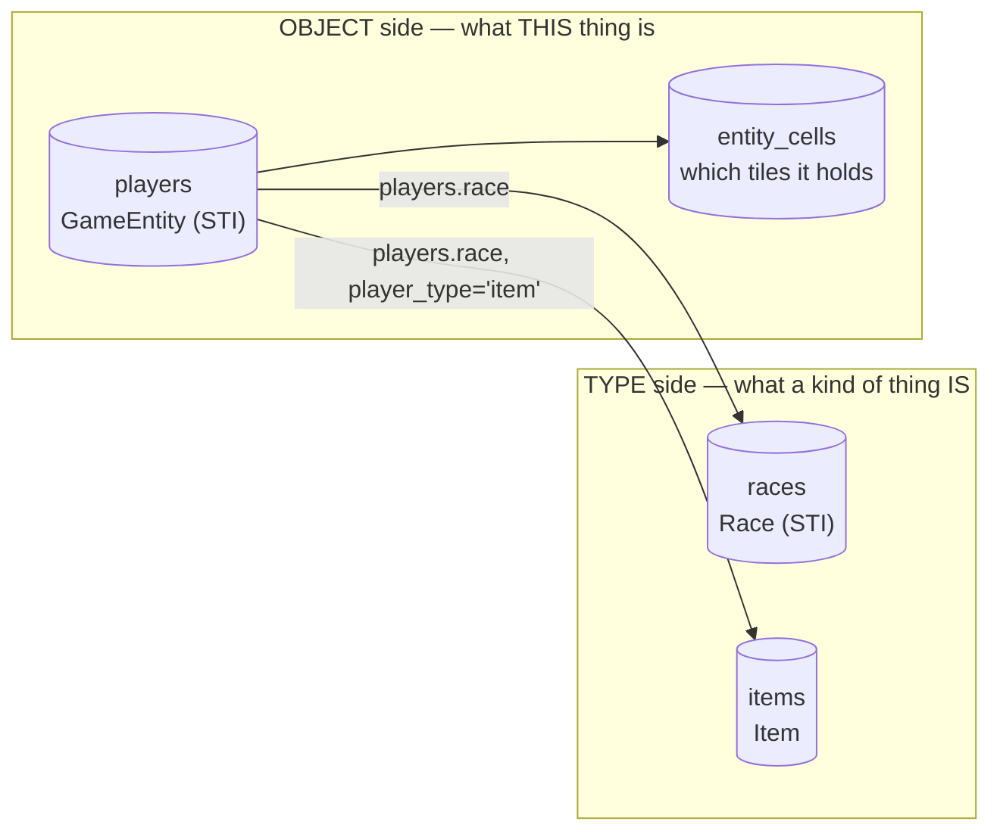
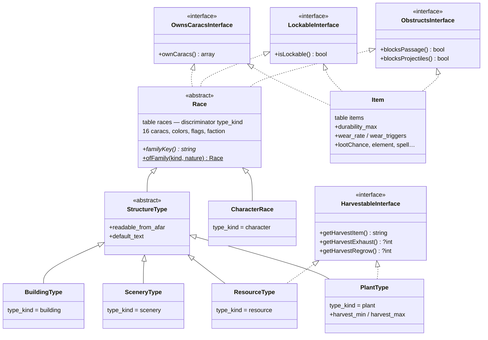
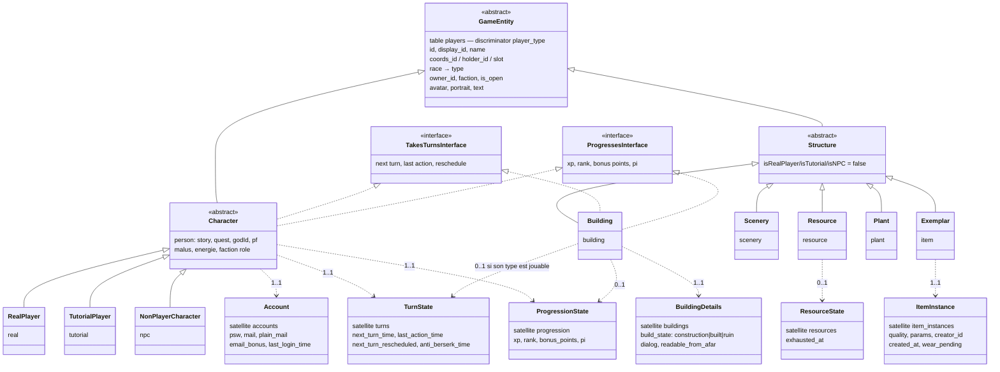
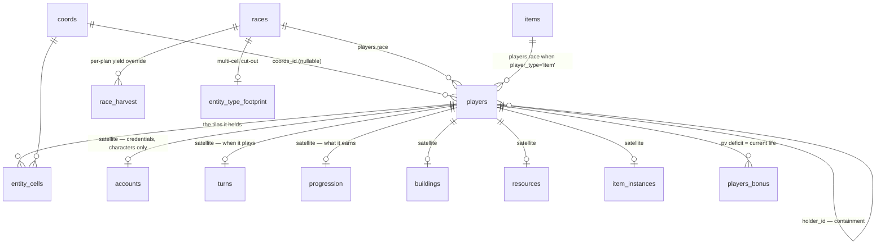
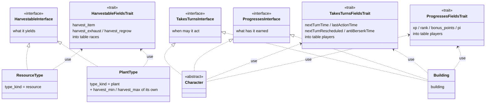
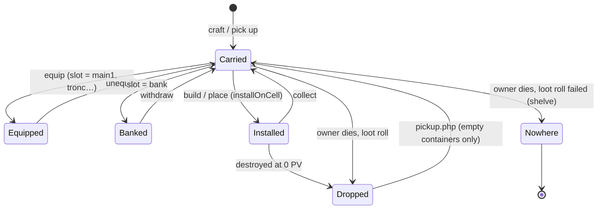
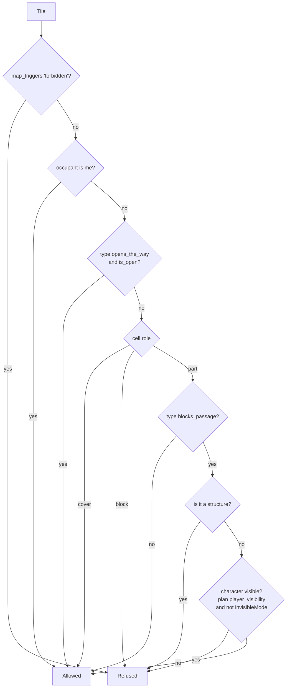
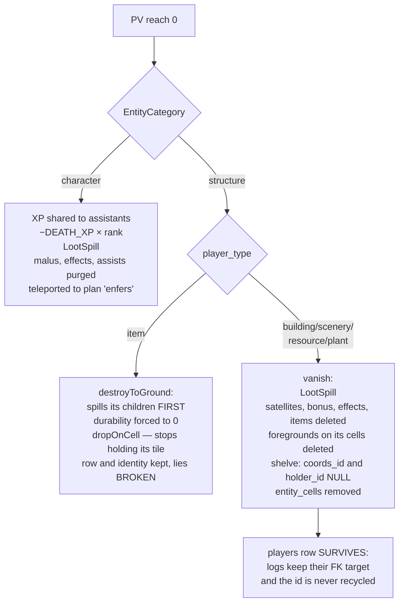
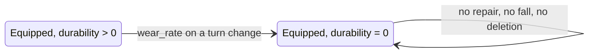

# Entity system — overview and capability reference

**Status**: synthesis of the delivered work (2026-08-03)
**Scope**: everything that is an entity on the board — characters, buildings, scenery,
resources, plants, walls and placed objects — and what each of them can do.

Design notes behind it: [design-buildings-entities.md](design-buildings-entities.md),
[design-entity-types-inheritance.md](design-entity-types-inheritance.md),
[design-resources-entities.md](design-resources-entities.md),
[design-walls-to-entities.md](design-walls-to-entities.md),
[design-items-instances.md](design-items-instances.md),
[design-vie-et-contenance.md](design-vie-et-contenance.md).

---

## 1. The one sentence

There are **two trees and one join**: a tree of *types* rooted in `races`, a tree of
*objects* rooted in `players`, and `players.race` points from an object to its type. A
third catalogue, `items`, types the object family that came from the item side. Every
capability — blocking, closing, bleeding, yielding, having a life — is a **column on the
type**, never a branch of the tree and never an `if` in a reader.



---

## 2. Code objects

### 2.1 The type tree — `races`, STI on `type_kind`



`HarvestableFieldsTrait` carries the three shared harvest columns for the two families that
implement `HarvestableInterface` — the pattern §2.6 spells out, and the one the object tree
copied for turns and progression. `Race::ofFamily()` is the **only** place in PHP that
derives a family from `(kind, structure_nature)`; once the object exists, its class answers
`familyKey()`. The same rule lives in SQL triggers, and `TypeFamilyColumnTest` compares the
two line by line.

### 2.2 The object tree — `players`, STI on `player_type`



**Hard rule from the plan: the hierarchy never grows a third level.** A kind that does not
fit `Character` / `Structure` gets a **satellite table**, not a new branch. `EntityCategory`
(`character` | `structure`) is the enum every reader asks instead of testing discriminators;
`item` is filed under `structure` on purpose, so it inherits the behaviours already right
for it (no malus, no bleeding, the `vanish` death path rather than the enfers one).

### 2.3 Capabilities on the object side

**Where this came from: a building cannot level up.** That is the observation the whole
strand started at. A forge already *has* `xp`, `rank`, `nextTurnTime` — `Character` is STI on
the same `players` table — so the data was never the obstacle. The obstacle was that those
fields were spelled as character-ness: to make anything else play, one had to make it a
character, and drag in an account, the enfers death path, missives and faction-membership
counting along with it.

So the type tree shares behaviour through interfaces (§2.1), and the object tree now does the
same for what is a *capability* rather than a branch:

| interface | who holds it | what it means |
|---|---|---|
| `TakesTurnsInterface` | `Character`, **`Building`** | has a next turn, a reschedule flag, a memory of its last action |
| `ProgressesInterface` | `Character`, **`Building`** | earns experience, holds a level and unspent points |

Both **read only**: the state lives in satellites and the services below are the writers, so
a setter on the contract would reach the mirror column alone and leave the satellite behind.

**A building holds both, and is not a character.** That is the whole strand landing: no
reparenting, no account, no enfers death path — just the two contracts and the two satellite
rows. `Scenery`, `Resource`, `Plant` and `Exemplar` hold neither; being a structure is not the
capability, holding it is.

Holding the capability says a building **may** play. Whether a given one **does** is its
type's answer, and it follows the §8.2 rule like every other configurable behaviour:

| question | answered by |
|---|---|
| may this *kind* of thing play? | the class, through the interface |
| does *this type* play? | `races.playable`, via `App\Service\PlaysTurns` |
| who may act with it? | `LockService::mayLock()` — owner, or faction member |

`PlaysTurns` is the one predicate: **a character plays by nature** — the hidden system races
`ame`, `dieu`, `animal` carry `playable = 0` and still take turns — **plus anything its type
declares playable**. It is a constant rather than inline SQL because the two services that
seed satellites and the migrations that backfill them must say it word for word.

The columns behind both capabilities are mapped by **traits** — `TakesTurnsFieldsTrait` and
`ProgressesFieldsTrait` — used by `Character` and `Building`, exactly as
`HarvestableFieldsTrait` is used on the type side. A capability crosses families that do not
form a subtree **without climbing onto the trunk**: `Scenery` maps none of them, because a
decor has no experience to hold. Same pattern, both trees — see **§2.6**.

Neither is character-ness: a playable building will take turns and earn its own experience
without ever having an account. Naming the contracts is what lets the gates switch from
*"is this a character?"* to *"does this take turns?"* one at a time, instead of in a sweep.

**The state has now moved to match.** Three satellites hold what `Character` used to carry on
its own row, each reached through one service that is the only writer:

| satellite | holds | gateway |
|---|---|---|
| `accounts` | psw, mail, plain mail, mail bonus, last login | `AccountService` |
| `turns` | next turn, last action, reschedule flag, anti-berserk | `TurnService` |
| `progression` | xp, rank, bonus points, pi | `ProgressionService` |

The `players` columns are still there and still written, as **mirrors**: `Player::get_row()`
joins the satellites with `COALESCE(NULLIF(…))`, so the ~120 call sites reading
`$player->data->xp` never moved. Dropping the columns is a post-deployment pass that deletes
one statement per service method. Until then, treat the satellite as the truth and the column
as its echo.

A building that levels up therefore needs no reparenting under `Character` — it needs a row
in `turns` and `progression`, and a controller, since it has no session. See
[design-playable-buildings.md](design-playable-buildings.md) and
[handoff-batiments-jouables.md](handoff-batiments-jouables.md).

### 2.4 Tables



### 2.5 Services that own a rule

| Service | Sole owner of |
|---|---|
| `Map\EntityLocationService` | where an entity is: `installOnCell` / `dropOnCell` / `putInside` / `shelve`, plus `cellOf()` walking up the holders |
| `Map\EntityCellService` | the **only writer** of `entity_cells`; lays every cell from origin + footprint, drops the ones the cut-out no longer claims |
| `Map\EntityTypeFootprintService` | the cut-out of a type (which cells, which role per piece) |
| `Map\TileOccupancyService` | "can a step land here?", "is it vacant?", "can I build here?" |
| `ObstructionService` | the two catalogues' answer to *what is passable / what stops arrows* |
| `BuildingService` | placing, opening, line of fire, ruin, vanish, admin removal |
| `LockService` | what has a door at all, and who may turn it |
| `ItemInstanceService` | exemplar life-cycle: create, equip, bank, drop, install, collect, broken-at |
| `WearService` | arming and applying wear on turn change |
| `LootSpillService` | what falls when anything dies — a character or a smashed chest, same code |
| `Map\ResourceStateService` / `ResourceService` | standing vs exhausted, harvest budget, regrow rolls |
| `Map\HarvestCatalogService` | yields per (plan, type), field-by-field override |
| `AccountService` | credentials: the hash a login is checked against, mail, mail bonus, last login, and the RGPD wipe |
| `TurnService` | when an entity plays: opening a turn, rescheduling it, touching the last action |
| `PlaysTurns` | the one predicate for *who owns a turn and a progression* — a character by nature, plus anything its type declares playable |
| `TurnProcessingService` | what a turn refreshes, and the fork between a character's (a body to recover) and a structure's (its pool and its clock) |
| `ProgressionService` | what an entity earns: the xp/pi/rank gain, the **conditional** PI debit, the season's ceiling |
| `PlayerService::ProcessTargetDeath` | the fork between character death and structure destruction |

### 2.6 Traits — a capability crossing families

Both trees are single-table inheritance, and in both of them the classes that share a
capability **do not form a subtree**. `ResourceType` and `PlantType` are siblings; so are
`Character` and `Building`. There are only two ways to give siblings the same columns, and
one of them is wrong:

| | |
|---|---|
| put the columns on the **trunk** | every family inherits them — a decor carries an `xp` it will never read, a dwarf race carries a `harvest_item` that answers `null`. The question becomes askable where it has no meaning |
| put them in a **trait** the holders use | only the holders map them. The question does not compile where it has no meaning |

The second is the rule here. **An interface names the capability, a trait carries its
columns, and the classes that hold it use both.** Doctrine maps a trait's columns into the
one table for each class that uses it — verified on the metadata rather than assumed, both
times.



| trait | contract | used by | maps into |
|---|---|---|---|
| `HarvestableFieldsTrait` | `HarvestableInterface` | `ResourceType`, `PlantType` | `races` |
| `TakesTurnsFieldsTrait` | `TakesTurnsInterface` | `Character`, `Building` | `players` |
| `ProgressesFieldsTrait` | `ProgressesInterface` | `Character`, `Building` | `players` |

**What does not use them maps nothing.** `Scenery`, `Resource`, `Plant` and `Exemplar` have
no `xp` column at all; `CharacterRace` and `BuildingType` have no `harvest_item`. That is the
whole benefit over the trunk, and it is pinned twice — by the interfaces, and by the columns
Doctrine actually maps, because those two can drift apart if a trait quietly goes missing.

Three notes worth keeping:

- **A trait is not the whole capability.** `PlantType` adds `harvest_min` / `harvest_max` of
  its own beside the shared three; a trait is the common floor, not a ceiling.
- **The trait carries state, the service carries writes.** These three are read-only:
  `TurnService`, `ProgressionService` and the harvest catalogue own the writing. A setter in
  the trait would reach the mirror column and leave the satellite behind (§2.3).
- **Neither trait was written before its second user.** `HarvestableFieldsTrait` says so in
  its own docblock — with one implementer there is nothing to share, only a detour to add.
  The same held here: the turn columns lived on `Character` until a building needed them.

---

## 3. Location is containment

An entity is **on a cell**, or **inside another entity**, or **nowhere**:

```
players.coords_id   the cell it stands on     (NULL = not on one)
players.holder_id   the entity holding it     (NULL = held by nobody)
players.slot        how it is held: '' (carried), 'main1', 'tronc', 'bank',
                    'installed', 'dropped'
```

Exactly one of `coords_id` / `holder_id` carries meaning; neither = off the world.



Consequences that fall out of the single relation rather than being coded as features:

| | |
|---|---|
| inventory | children of the character (`holder_id` = them) |
| a chest's contents | children of the chest |
| "a container holding something cannot be picked up" | it has children |
| "a smashed chest loots like a dying player" | re-parent children to the cell — *the same service* |
| an item on the ground | `coords_id` set, `slot = 'dropped'`, no holder |

`putInside()` refuses self-holding and cycles; `cellOf()` and `holds()` walk at most 16
levels deep.

**Asking where something is never puts it somewhere.** `Player::getCoords()` reads the same
chain — its own cell, else its holder's, else null — through `EntityLocationService::cellOf()`,
so a carried sword answers its bearer's tile and a shelved building answers *nowhere*. It is a
pure read: nothing places an entity as a side effect of being asked about. Callers therefore
handle `null`, and `ActorInterface::getCoords()` says `?object`.

**Installed vs dropped is the whole difference** between a placed object and litter: what
is `dropped` occupies no cell (`entity_cells` removed), so it blocks nothing, screens
nothing, is not a valid target, and blocks no construction.

---

## 4. One life for everything

```
max PV      = the TYPE's own stat block  (races.pv | items.durability_max)  + bonuses
current PV  = max − deficit row in players_bonus (name='pv', negative n)
pristine    = no row at all
broken/dead = current ≤ 0        (ItemInstanceService::BROKEN_AT = 0)
```

The type answers through `OwnsCaracsInterface`; `EntityTypeCaracsService` is the only place
that decides *which catalogue to read* from the discriminator. A race owns all sixteen
caracs; an item owns exactly one — `pv`, from `durability_max` — and its other fifteen
columns stay *conferred to the bearer*, never owned. So an object's toughness is its life
total, not a resistance: it has no defence stat and takes the floor of 1 damage per hit.

Raising `items.durability_max` or `races.pv` in the catalogue lifts every existing
individual immediately — there is no frozen snapshot anywhere.

---

## 5. Capability matrix

### 5.1 What is configurable — on the TYPE (`races`)

| Column | Meaning | Who it matters to |
|---|---|---|
| `pv` + 15 caracs | own stat block, hence max life | all |
| `blocks_passage` | does one walk through it | structures |
| `blocks_projectiles` | does it stop an arrow | all (characters too — off by default) |
| `lockable` | does it have a door / a lid at all | buildings, doors, chests |
| `opens_the_way` | does its closure decide **passage** (a door, and only a door) | doors |
| `bleeds` | map element poured when wounded (`sang`, `''` = a wall does not bleed) | all |
| `wound_color` | tint of the damage veil | all |
| `structure_nature` | `edifice` (true building, has a door) vs `obstacle` (built wall) | structures |
| `readable_from_afar`, `default_text` | inscription visible without stepping in | structures |
| `harvest_item` / `harvest_exhaust` / `harvest_regrow` | what it yields, per-thousand odds of running out and of coming back | resources, plants |
| `harvest_min` / `harvest_max` | how much one picking gives | plants |
| `playable` | may this type be **driven** — by a registering player, or (to come) through faction access | character races, and playable building types |
| `hidden` | kept out of what a player is shown: creation, lists, rankings | all |
| `faction`, `plan`, `animateur_id`, colors, portrait/avatar counters | presentation and ownership defaults | all |
| footprint (`entity_type_footprint`) | which cells a type occupies, and the role of each piece | multi-cell structures |
| `race_harvest` (plan, type) | per-plan override of the yield, **field by field** | resources, plants |

### 5.2 What is configurable — on the ITEM type (`items`)

`durability_max` (= its life), `blocks_passage`, `blocks_projectiles`, `lockable`,
`wear_rate` + `wear_triggers` (CSV subset of `attack,defense,move,usage`), `lootChance`,
`grow_rate` (for seeds), `private`, `enchanted`, `vorpal`, `cursed`, `element`, `spell`,
plus the fifteen conferred caracs.

### 5.3 What each individual carries

On `players`: `name`, `display_id`, location triple, `race` (its type), `owner_id`,
`faction`, `is_open`, `avatar`, `portrait`, `text`.
On satellites: `accounts` (credentials), `turns` (next turn, last action, reschedule flag,
anti-berserk), `progression` (xp, rank, bonus points, pi), `buildings.build_state` / `dialog`
/ `readable_from_afar` (per-entity override), `resources.exhausted_at`,
`item_instances.quality` / `params` / `creator_id` / `created_at` / `wear_pending`.
Life lives in `players_bonus`, for every family alike.

**A level is not life.** Progression is filed in its own satellite precisely because
`vanish()` deletes `players_bonus`, `players_effects` and `players_items` for the entity. Life
is a deficit and *should* be wiped on destruction; a level must not be — a destroyed building
keeps it, in the void, with its surviving row (§6.4).

### 5.4 Behaviour by family

| | Character | Building | Scenery (decor) | Resource | Plant | Exemplar — installed | Exemplar — dropped |
|---|---|---|---|---|---|---|---|
| `player_type` | real / tutorial / npc | building | scenery | resource | plant | item | item |
| default cell role | — | `part` | **`cover`** | **`block`** | `part` | `part` | *(no cell)* |
| walk through | only if invisible or plan hides characters | type says (usually no) | **yes** (a decor is a drawing) | **no**, always | **yes** (`blocks_passage = 0`) | type says | **yes** — occupies nothing |
| arrows through | yes unless its race says otherwise | type says (usually no) | yes on `cover` cells, no on marked ones | no | **yes** | type says | yes |
| can be targeted / hit | yes | yes | yes | yes | yes | yes | **no** — "on le ramasse, on ne le vise pas" |
| opens / closes | — | if `lockable` | no | no | no | if its item type is `lockable` (chests) | no |
| harvestable | — | — | — | `fouiller` from an adjacent tile | picked with `ramasser` on the tile | — | — |
| picked up | — | — | — | — | yes (removes it) | `collect` | `pickup.php`, only if it holds nothing |
| holds an inventory | yes | yes | yes | yes | yes | yes (a chest) | yes, but that blocks pickup |
| at 0 PV | enfers + XP loss | `vanish` | `vanish` | `vanish` | `vanish` | falls **broken** on its own cell | already there — stays broken |
| repairable | heal | yes, unless broken | yes — a chipped statue is re-carved | **no** — a vein runs out and grows back | **no** | yes, unless broken | no — cannot be targeted at all |
| takes turns / progresses | **yes**, by nature | **if its type is `playable`** — turn = pool + clock, no XP for standing still | no | no | no | no | no |

Repairability is declared **on the type** (`races.repairable`, nullable = ask the family), not
deduced from the branch. See §7.

---

## 6. The rules, precisely

### 6.1 Can I step there? (`TileOccupancyService::blockedForStep`)



Three neighbouring questions use the same occupancy source but different strictness:

- **step** — the flow above; a thing blocks only if it blocks *and* the mover can see it.
- **landing** (`isVacant`) — stricter: any entity except decor, plus **any** trigger.
- **building** (`buildRefusal`) — any entity occupies (decor included for a player, which an
  animator may override), plus `map_elements` the catalogue does not declare buildable-over;
  triggers ignored, so one can build on a teleporter but not land on it.

`entity_cells` and `players.coords_id` **add up** in that query: an entity moved without
`syncCells()` keeps stale cells, and dropping either source would make it walk-through where
it really stands. What is merely `dropped` is excluded from both.

### 6.2 Can I shoot through? (`BuildingService::lineOfFireReport`)

- Bresenham between the two points, endpoints excluded, **both** traversals computed.
- A shot passes if **one traversal is clear**; if both are barred, the blocker named is the
  first one *along the shot line*, so the green trace on the board stops where the impact is.
- An entity screens **every cell it holds**, not just its origin — a 2×2 wall used to stop
  arrows on a quarter of itself. `cover` cells are excluded: the back of a building must not
  make whoever stands there unreachable.
- An **open door lets the arrow through too** — same opening governs step and shot.
- **A target never screens itself** (its own cells are subtracted), which only showed up on
  multi-cell objects.
- Doors are race types only; the discriminator guards against homonymous items.

### 6.3 Open, closed, and closing by itself (`BuildingService::closureReason`)

One function answers *why is this shut*, for observe, HUD and admin alike, in this order:

1. `build_state = ruin` → **"en ruine"**
2. `build_state = construction` → **"en construction"**
3. **PV below 50 %** (`CLOSED_BELOW_PV_PCT`) → **"endommagé"** — this is the automatic
   closure: nothing writes a flag, damage alone shuts the place, and repairing reopens it
4. `is_open = 0` **and** the type is `lockable` → **"fermé volontairement"**
5. otherwise → open

A closed thing keeps its dialogue silent. Voluntary closure lives on the **entity**, so the
rule already covers what has no building satellite (a chest). `setOpen()` refuses outright
on a type without a door rather than writing a flag nobody reads. `LockService::mayLock()`:
the owner may, a member of the same faction may — and a thing with **neither owner nor
faction stays open to everybody**, which beats a lock nobody can turn.

### 6.4 Dying and being destroyed

There are **three ways to reach zero**, and they differ by *where the thing was*, not by
what it is — location decides, as everywhere else in this model:

| | trigger | what happens |
|---|---|---|
| on a cell, holding it | damage | structure → `vanish`; exemplar → `destroyToGround` |
| **worn** | **wear on one of its triggers** | **stays exactly where it is, broken — see §6.7** |
| worn | a break roll in combat (`ITEM_BREAK`) | the unit is removed outright and part of its recipe returned — an older mechanism that never touches durability |

**A stack sitting in a bag reaches zero by no path at all**: wear only arms what is worn,
and the break roll only reads equipment slots. Quantities have no life to lose — only an
individuated exemplar does (§2.4), so nothing in a bag decays.



- A chest **spills before it falls**: what it held must not stay shut inside an object lying
  on the ground, since a container holding anything cannot be picked up.
- Loot rolls are `items.lootChance`, halved for equipped gear on a player, 0 for equipped
  gear on an NPC and 100 for the rest of an NPC's bag. What fails its roll is **shelved**
  (nowhere), not deleted.
- `markDestroyed()` / `restore()` are the admin ruin path: ruin swaps to the `_broken`
  sprite, restore clears the PV deficit and flips `build_state` back to `built`.
- **Broken is terminal.** `reparer` refuses an intact target (it would farm XP for a
  zero-value heal) *and* refuses one at 0 (`RequiresDamagedTargetCondition`, reading
  `BROKEN_AT`). What becomes of a broken object beyond lying there is still open.

### 6.5 Harvesting

**Resources** (`fouiller` on an adjacent tile):

- Yields come from the (plan, type) pair: the type carries the default, `race_harvest`
  overrides it **field by field** — the same tree gives less in the desert than in the
  forest, and the plan only has to carry the number that changes. Plan JSON is a seed,
  replayable from admin → Cartes → Rendements; it is never read at runtime.
- One `1dN` roll per resource type around, logged through `DiceLog` like a combat roll.
- Exhaustion is **budgeted by what was actually harvested**: no more veins run out than
  units were gathered. Odds are per **thousand** (`exhaust = 20` → 1.9 % per attempt).
- An exhausted resource **stays standing** — it still blocks the step and the arrow — and
  regrows in place, `regrow`/1000 per hourly cron pass (`scripts/crons/hourly/refresh_resources.php`).
- Its state lives in the `resources` satellite (`exhausted_at`), not in a map table.

**Plants**:

- Grow on `map_triggers` named `grow` whose cell is free of entity, element and route;
  `items.grow_rate` sets the odds (or `AUTO_GROW`).
- Picked **explicitly** with `ramasser` (`pickup.php`) — walking over a plant does not take
  it. It yields `harvest_item` (falling back to its own name) × `rand(harvest_min, harvest_max)`,
  keeps its own `harvest` log entry, and the entity is deleted (its cells cascade).
- A plant whose item left the catalogue stays in the ground rather than vanishing for nothing.

### 6.6 Placing and building

`PlaceStructureOutcomeInstruction` is the data-driven outcome of *construire*:

- Target cell is either **chosen** (`build_picker.js` → validated by `BuildSiteCondition`
  before any payment) or the first free adjacent cell.
- If the type is a **race** of kind structure → `BuildingService::place()` mints a building
  (actor becomes owner, faction copied).
- Otherwise the type is an **item** → `installFromCatalogAt()`: the exemplar is *born
  standing on the cell*. A built chest is the object it is — it can then be picked up again
  and keeps its identity.

### 6.7 Wear

`WearService::arm()` marks equipped instances whose type lists the event in `wear_triggers`
(`attack`, `defense`, `move`, `usage`) — only what is **worn** wears, never what sits in the
bag or the bank. The turn change applies `wear_rate` to each armed instance, writing the new
deficit in `players_bonus`, and prints *"s'est brisé !"* when it lands on zero.

**Worn to zero is the third zero, and nothing moves.** An item that wears out is not on a
cell, so none of the destruction paths applies to it:



Concretely, once broken while worn it:

- **stays in its slot** — visibly equipped, `slot` unchanged; nothing unequips it;
- **confers nothing** — `get_caracs()` skips a broken item's stat block explicitly, which is
  the gameplay meaning of *brisé*: you carry a useless sword, you do not silently keep its
  bonus (`Classes/Player.php:264`);
- **shows red** — `stateLine()` prints **Brisé** instead of a durability bar, everywhere at
  once (inventory, market, exchanges);
- **keeps its identity** — the exemplar row, its custom name, its quality and its creator all
  survive; `item_instances.destroyed` is *not* set (nothing in the codebase sets it — the
  state is expressed by durability alone);
- **cannot be repaired** — `RequiresDamagedTargetCondition` refuses at `BROKEN_AT`;
- **cannot be attacked** — held, not on a cell, so it holds no tile and is not a valid target.

So a worn-out item is a permanent dead weight in the slot. What one may do with it beyond
carrying it — salvage, melt, sell for scrap — is deliberately still open.

Separately, `DamageObjectOutcomeInstruction` breaks *equipment* outright on a roll
(`ITEM_BREAK`, raised for materials matching an active corruption), returning part of the
recipe's materials — corrupted materials are lost. It reads the equipment slots
(`main1`, `main2`, `tronc`, `tete`) and removes the unit instead of zeroing it, so the two
paths must not be confused — and neither of them can reach a stack in the bag.

---

## 7. Targeting a family, not just a branch

`reparer` was created (`Version20260716150000_ActionTargetCategories`) with
`TargetType{allowed:['structure']}` — the coarse `EntityCategory`, under which *every*
non-character family lives. So a damaged **tree, ore vein or shrub was repaired with a
hammer and planks**, at the game's best XP rate (3 XP per action point). Only the other half
of the rule had ever been tightened: `RequiresDamagedTargetCondition` says *something must
be damaged, and not broken* — never *what kind of thing may be repaired at all*.

**The declaration now names families.** `TargetType.allowed` accepts, alongside the two
branches, the five structure discriminators — `building`, `scenery`, `resource`, `plant`,
`item` (`EntityCategory::structureFamilies()`). A named family is enough; the branch stays
the umbrella.

**But repair is not settled there** — two answers to the same question had been written in
parallel, and the finer one wins:

| gate | question | for `reparer` |
|---|---|---|
| `TargetType.allowed` | which **kinds** does this action reach? | `['structure']` — the wide envelope |
| `races.repairable` + `RequiresRepairableTarget` | does **this type** mend? | family default (built and scenery yes, what grows no), overridable per type |

The envelope has to stay wide: a list of families frozen in an action's data cannot be
contradicted by a type, and the promise of the column is that a type may contradict its
family *in both directions* — a carved stone well that does mend, a shack that does not.
The condition is declared `display_context`, so the button disappears from what cannot be
mended instead of appearing and failing on click.

A plant is a case where both gates agree for different reasons: no plant type exceeds 1 PV,
so a damaged plant is already broken, and `RequiresDamagedTarget` refuses it before the type
is ever consulted.

Three consequences of the family vocabulary, worth knowing:

- **One matcher, two readers.** `TargetTypeCondition::reaches()` is the rule, and
  `ActionTargeting::canTargetEntity()` calls it. The two used to each read `allowed` their
  own way, and the view only ever knew branches — the *Réparer* button would have kept
  showing on a tree, for a refusal at execution.
- **The refusal names the target**, not the branch: *"Cette action ne peut pas viser une
  ressource."* Saying *une structure* was misleading for an action that repairs buildings.
- **Attacks are untouched** (`['character','structure']`): felling a tree is intended. It was
  only the healing direction that had no business reaching a plant. `consacrer` / `venerer`
  were already narrowed by a `TargetRace{allowed:['altar']}`, so they never had the problem.

The vocabulary is spelled in three places — the discriminator that creates a family, the
label that offers it in the workbench, the article that refuses it —
and `EntityFamiliesVocabularyTest` fails if they drift apart.

*(That last consequence now applies to every action but `reparer`, whose refusal comes from
the type gate: "Cela ne se répare pas.")*

---

## 8. Invariants worth keeping

1. **The tree never grows a third level.** New kind ⇒ new satellite, not a new branch.
2. **The type carries its configuration.** Adding a type must be enough; the plan only
   overrides. Any `if (this is a chest)` in a reader is the bug.
3. **`EntityCellService` is the sole writer of `entity_cells`**, and it is idempotent —
   call it after any write to `coords_id`.
4. **Occupancy = `entity_cells` ∪ `players.coords_id`, minus what is `dropped`.**
5. **One life store** (`players_bonus`), one max source (the type), no frozen snapshot.
6. **A destroyed structure's row survives** — logs stay true, ids are never recycled.
7. **Nothing derives a family from columns after construction** — ask the class.
8. **A gate declares what it reaches**, at the finest level it means (family before branch),
   and the display reads the same matcher as the execution.
9. **A capability is a satellite plus a service, never a branch.** What only some entities do
   moves off the `players` row into its own table, with one service as the sole writer. New
   gates ask the capability (`TakesTurnsInterface`), not the class.
10. **While a column is mirrored, the satellite is the truth and the column is the echo.** A
    write that skips the service desynchronises them silently, and the `NULLIF` join is what
    keeps the column winning until the service has caught up. Route the write; never patch the
    column.
11. **A shared capability goes in a trait, never on the trunk** (§2.6). The classes that hold
    it rarely form a subtree; a trait gives them the columns without giving them to everything
    else. And it waits for its **second** user — with one implementer there is nothing to
    share, only a detour to add.
