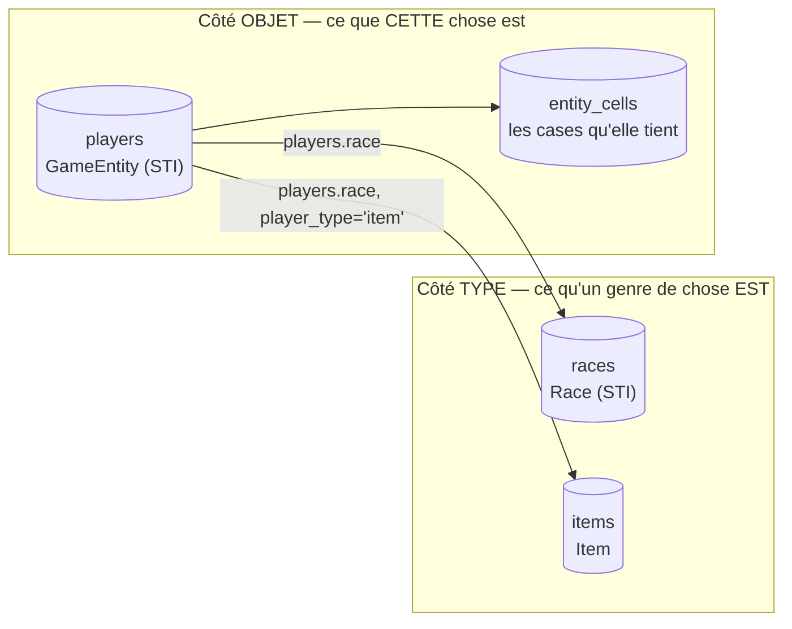
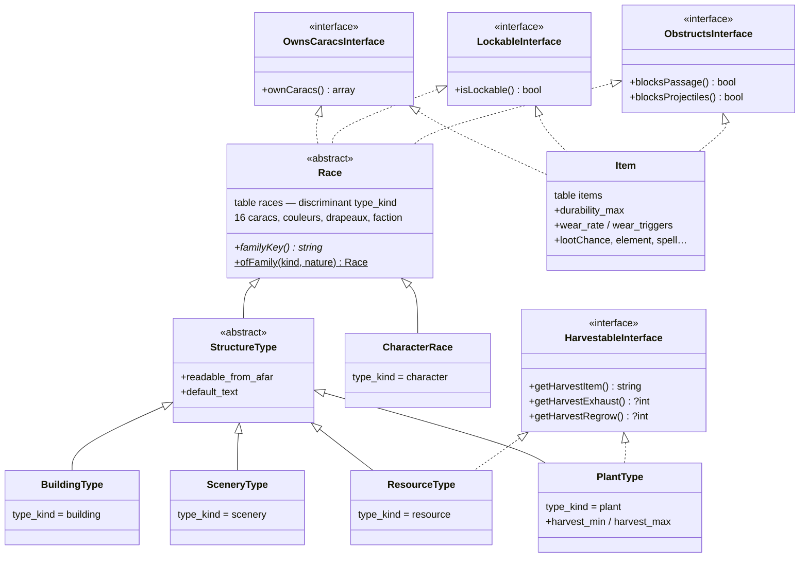
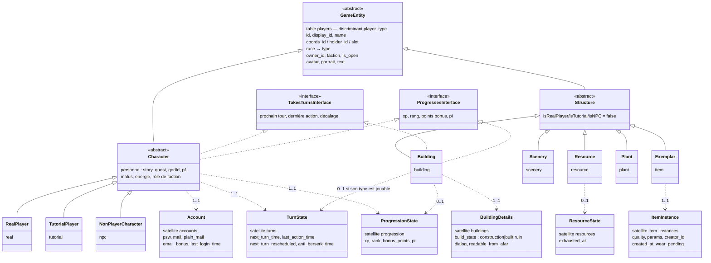
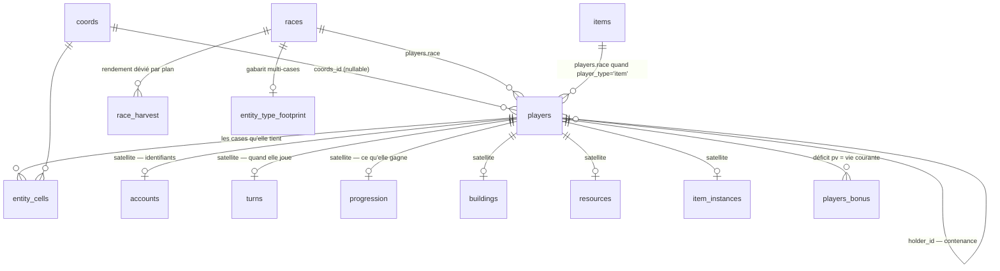
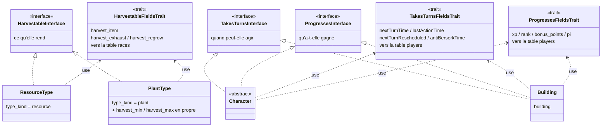
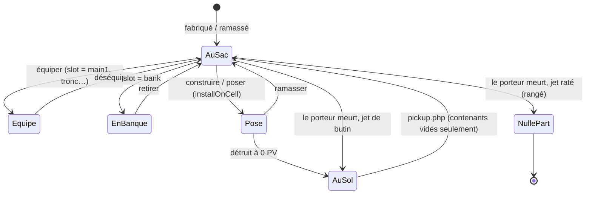
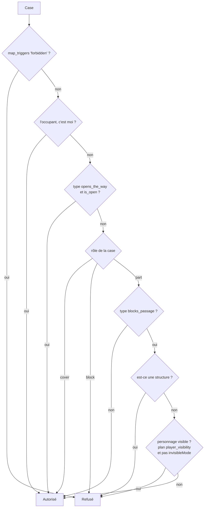
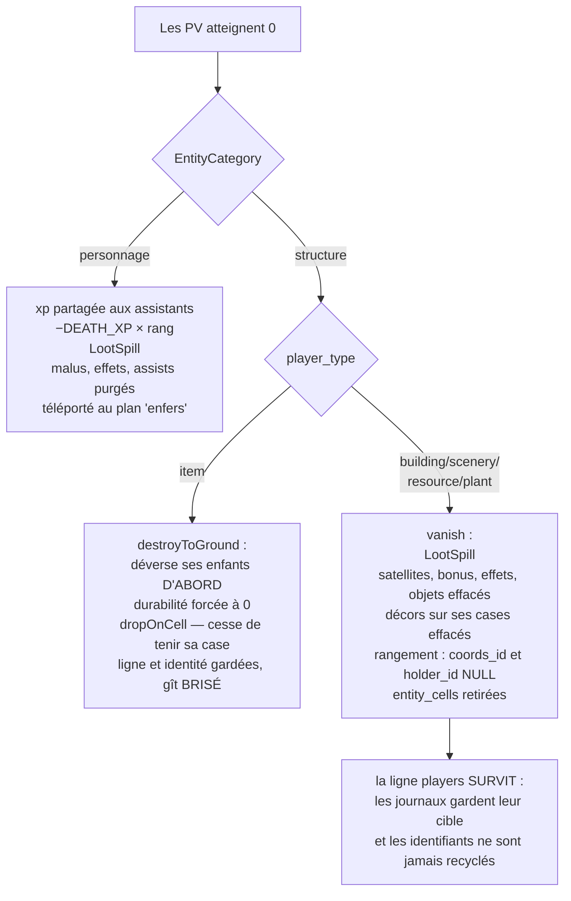
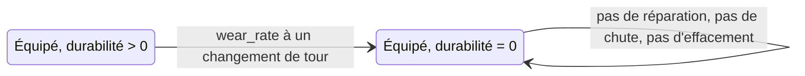

# Système d'entités — panorama et référence des capacités

**État** : synthèse de ce qui est livré (2026-08-03)
**Portée** : tout ce qui est une entité sur le plateau — personnages, bâtiments, décors,
ressources, plantes, murs et objets posés — et ce que chacun sait faire.

> **Version française de [entity-system-overview.md](entity-system-overview.md).** Les deux
> documents portent la même numérotation de sections : `§6.3` désigne le même passage dans
> l'un et dans l'autre. Quand le système bouge, les deux bougent ensemble — un panorama à
> moitié à jour ment plus qu'il n'informe.

Notes de conception derrière : [design-buildings-entities.md](design-buildings-entities.md),
[design-entity-types-inheritance.md](design-entity-types-inheritance.md),
[design-resources-entities.md](design-resources-entities.md),
[design-walls-to-entities.md](design-walls-to-entities.md),
[design-items-instances.md](design-items-instances.md),
[design-vie-et-contenance.md](design-vie-et-contenance.md).

---

## 1. En une phrase

Il y a **deux arbres et une jointure** : un arbre de *types* enraciné dans `races`, un arbre
d'*objets* enraciné dans `players`, et `players.race` pointe de l'objet vers son type. Un
troisième catalogue, `items`, type la famille d'objets venue du côté objet. Chaque
capacité — bloquer, fermer, saigner, rendre, avoir une vie — est une **colonne sur le type**,
jamais une branche de l'arbre et jamais un `if` dans un lecteur.



---

## 2. Les objets du code

### 2.1 L'arbre des types — `races`, STI sur `type_kind`



`HarvestableFieldsTrait` porte les trois colonnes de récolte partagées par les deux familles
qui implémentent `HarvestableInterface` — le motif que détaille le §2.6, et celui que l'arbre
des objets a repris pour le tour et la progression. `Race::ofFamily()` est le **seul** endroit
en PHP qui déduit une famille de `(kind, structure_nature)` ; une fois l'objet créé, c'est sa
classe qui répond `familyKey()`. La même règle vit dans des déclencheurs SQL, et
`TypeFamilyColumnTest` compare les deux ligne à ligne.

### 2.2 L'arbre des objets — `players`, STI sur `player_type`



**Règle dure du plan : la hiérarchie ne prend jamais un troisième niveau.** Un genre qui
n'entre ni dans `Character` ni dans `Structure` reçoit une **table satellite**, pas une
branche de plus. `EntityCategory` (`character` | `structure`) est l'énumération que tout
lecteur interroge au lieu de tester des discriminants ; `item` est rangé sous `structure`
exprès, pour hériter des comportements déjà justes pour lui (pas de malus, pas de saignement,
le chemin de mort `vanish` plutôt que celui des enfers).

### 2.3 Les capacités côté objet

**D'où ça vient : un bâtiment ne peut pas monter de niveau.** C'est le constat par lequel tout
le chantier a commencé. Une forge *a* déjà `xp`, `rank`, `nextTurnTime` — `Character` est en
STI sur la même table `players` — donc la donnée n'a jamais été l'obstacle. L'obstacle, c'est
que ces champs s'écrivaient comme de la « personnage-ité » : pour faire jouer autre chose, il
fallait en faire un personnage, et embarquer avec lui un compte, le chemin de mort des enfers,
les missives et le comptage des membres de faction.

L'arbre des types partage donc son comportement par des interfaces (§2.1), et l'arbre des
objets fait désormais pareil pour ce qui relève d'une *capacité* et non d'une branche :

| interface | qui la porte | ce qu'elle veut dire |
|---|---|---|
| `TakesTurnsInterface` | `Character`, **`Building`** | a un prochain tour, un drapeau de décalage, la mémoire de sa dernière action |
| `ProgressesInterface` | `Character`, **`Building`** | gagne de l'expérience, tient un niveau et des points à dépenser |

Les deux sont en **lecture seule** : l'état vit dans des satellites et ce sont les services
plus bas qui écrivent. Un setter sur le contrat atteindrait la colonne miroir seule et
laisserait le satellite en arrière.

**Un bâtiment porte les deux, et n'est pas un personnage.** C'est l'aboutissement du
chantier : pas de reparentage, pas de compte, pas de chemin des enfers — seulement les deux
contrats et les deux lignes satellites. `Scenery`, `Resource`, `Plant` et `Exemplar` n'en
portent aucun ; être une structure n'est pas la capacité, la porter l'est.

Porter la capacité dit qu'un bâtiment **peut** jouer. Si celui-ci **joue**, c'est son type qui
répond, et cela suit la règle §8.2 comme tout autre comportement configurable :

| question | qui répond |
|---|---|
| ce *genre* de chose peut-il jouer ? | la classe, par l'interface |
| ce *type*-ci joue-t-il ? | `races.playable`, via `App\Service\PlaysTurns` |
| qui a le droit d'agir avec ? | `LockService::mayLock()` — propriétaire, ou membre de la faction |

`PlaysTurns` est le prédicat unique : **un personnage joue par nature** — les races système
cachées `ame`, `dieu`, `animal` portent `playable = 0` et prennent pourtant leurs tours — **plus
tout ce que son type déclare jouable**. C'est une constante et non du SQL en ligne, parce que
les deux services qui sèment les satellites et les migrations qui les remplissent doivent le
dire au mot près.

Les colonnes derrière les deux capacités sont portées par des **traits** —
`TakesTurnsFieldsTrait` et `ProgressesFieldsTrait` — employés par `Character` et `Building`,
exactement comme `HarvestableFieldsTrait` l'est côté types. Une capacité traverse des familles
qui ne forment pas un sous-arbre **sans remonter sur le tronc** : `Scenery` n'en cartographie
aucune, parce qu'un décor n'a pas d'expérience à tenir. Même motif, dans les deux arbres —
voir **§2.6**.

Ni l'une ni l'autre n'est de la personnage-ité : un bâtiment jouable prendra ses tours et
gagnera sa propre expérience sans jamais avoir de compte. Nommer les contrats est ce qui
permet de basculer les gardes de *« est-ce un personnage ? »* vers *« est-ce que ça prend des
tours ? »* une à une, plutôt qu'en un balayage.

**L'état a maintenant suivi.** Trois satellites portent ce que `Character` tenait sur sa propre
ligne, chacun atteint par un service qui en est le seul écrivain :

| satellite | contient | porte d'entrée |
|---|---|---|
| `accounts` | mot de passe, courriel, courriel en clair, bonus courriel, dernière connexion | `AccountService` |
| `turns` | prochain tour, dernière action, drapeau de décalage, anti-berserk | `TurnService` |
| `progression` | xp, rang, points bonus, pi | `ProgressionService` |

Les colonnes de `players` sont toujours là et toujours écrites, en **miroirs** :
`Player::get_row()` joint les satellites avec `COALESCE(NULLIF(…))`, si bien que les quelque
120 sites qui lisent `$player->data->xp` n'ont pas bougé. Leur suppression est un passage
post-déploiement qui retire une requête par méthode de service. D'ici là, le satellite est la
vérité et la colonne son écho.

Un bâtiment qui monte de niveau n'a donc besoin d'aucun reparentage sous `Character` — il lui
faut une ligne dans `turns` et une dans `progression`, et un pilote, puisqu'il n'a pas de
session. Voir [design-playable-buildings.md](design-playable-buildings.md) et
[handoff-batiments-jouables.md](handoff-batiments-jouables.md).

### 2.4 Les tables



### 2.5 Les services qui possèdent une règle

| Service | Seul maître de |
|---|---|
| `Map\EntityLocationService` | où est une entité : `installOnCell` / `dropOnCell` / `putInside` / `shelve`, plus `cellOf()` qui remonte les porteurs |
| `Map\EntityCellService` | le **seul écrivain** d'`entity_cells` ; pose chaque case depuis l'origine + le gabarit, retire celles que le gabarit ne réclame plus |
| `Map\EntityTypeFootprintService` | le gabarit d'un type (quelles cases, quel rôle par morceau) |
| `Map\TileOccupancyService` | « peut-on poser le pas ici ? », « est-ce libre ? », « peut-on construire ici ? » |
| `ObstructionService` | la réponse des deux catalogues à *ce qui se traverse / ce qui arrête une flèche* |
| `BuildingService` | poser, ouvrir, ligne de tir, ruine, `vanish`, retrait par l'animation |
| `LockService` | ce qui a une porte, et qui a le droit de la tourner |
| `ItemInstanceService` | cycle de vie d'un exemplaire : créer, équiper, mettre en banque, jeter, poser, ramasser, seuil de brisure |
| `WearService` | armer et appliquer l'usure au changement de tour |
| `LootSpillService` | ce qui tombe quand quoi que ce soit meurt — un personnage ou un coffre fracassé, le même code |
| `Map\ResourceStateService` / `ResourceService` | debout ou épuisée, budget de récolte, jets de repousse |
| `Map\HarvestCatalogService` | rendements par (plan, type), déviation champ par champ |
| `AccountService` | les identifiants : le condensat qu'une connexion vérifie, le courriel, son bonus, la dernière connexion, et l'effacement RGPD |
| `TurnService` | quand une entité joue : ouvrir un tour, le décaler, toucher la dernière action |
| `PlaysTurns` | le prédicat unique de *qui possède un tour et une progression* — un personnage par nature, plus ce que son type déclare jouable |
| `TurnProcessingService` | ce qu'un tour rafraîchit, et la bifurcation entre celui d'un personnage (un corps à récupérer) et celui d'une structure (sa réserve et son horloge) |
| `ProgressionService` | ce qu'une entité gagne : le gain xp/pi/rang, le débit **conditionnel** de Pi, le palier de saison |
| `PlayerService::ProcessTargetDeath` | la bifurcation entre mort de personnage et destruction de structure |

### 2.6 Les traits — une capacité qui traverse les familles

Les deux arbres sont en héritage sur table unique, et dans les deux, les classes qui partagent
une capacité **ne forment pas un sous-arbre**. `ResourceType` et `PlantType` sont sœurs ;
`Character` et `Building` aussi. Il n'y a que deux façons de donner les mêmes colonnes à des
sœurs, et l'une est mauvaise :

| | |
|---|---|
| poser les colonnes sur le **tronc** | toutes les familles en héritent — un décor porte une `xp` qu'il ne lira jamais, une race de nain un `harvest_item` qui répond `null`. La question devient posable là où elle n'a pas de sens |
| les mettre dans un **trait** qu'emploient les porteurs | seuls les porteurs les cartographient. La question ne compile pas là où elle n'a pas de sens |

C'est la seconde, ici. **Une interface nomme la capacité, un trait porte ses colonnes, et les
classes qui la tiennent emploient les deux.** Doctrine cartographie les colonnes d'un trait
dans l'unique table pour chaque classe qui l'emploie — vérifié sur les métadonnées plutôt que
supposé, les deux fois.



| trait | contrat | employé par | cartographié dans |
|---|---|---|---|
| `HarvestableFieldsTrait` | `HarvestableInterface` | `ResourceType`, `PlantType` | `races` |
| `TakesTurnsFieldsTrait` | `TakesTurnsInterface` | `Character`, `Building` | `players` |
| `ProgressesFieldsTrait` | `ProgressesInterface` | `Character`, `Building` | `players` |

**Ce qui ne les emploie pas ne cartographie rien.** `Scenery`, `Resource`, `Plant` et
`Exemplar` n'ont aucune colonne `xp` ; `CharacterRace` et `BuildingType` n'ont pas de
`harvest_item`. C'est tout le bénéfice sur le tronc, et il est épinglé deux fois — par les
interfaces, et par les colonnes que Doctrine cartographie réellement, parce que les deux
peuvent diverger si un trait disparaît en silence.

Trois notes à garder :

- **Un trait n'est pas toute la capacité.** `PlantType` ajoute ses propres `harvest_min` /
  `harvest_max` à côté des trois partagées ; un trait est le plancher commun, pas un plafond.
- **Le trait porte l'état, le service porte les écritures.** Les trois sont en lecture seule :
  `TurnService`, `ProgressionService` et le catalogue de récolte tiennent l'écriture. Un
  setter dans le trait atteindrait la colonne miroir et laisserait le satellite en arrière
  (§2.3).
- **Aucun des traits n'a été écrit avant son deuxième utilisateur.** `HarvestableFieldsTrait`
  le dit dans son propre docblock : à un seul implémenteur il n'y a rien à mutualiser,
  seulement un détour à ajouter. Ça a tenu ici aussi — les colonnes du tour vivaient sur
  `Character` jusqu'à ce qu'un bâtiment en ait besoin.

---

## 3. Être quelque part, c'est être contenu

Une entité est **sur une case**, ou **dans une autre entité**, ou **nulle part** :

```
players.coords_id   la case où elle se tient   (NULL = sur aucune)
players.holder_id   l'entité qui la porte      (NULL = portée par personne)
players.slot        comment elle est portée : '' (au sac), 'main1', 'tronc',
                    'bank', 'installed', 'dropped'
```

Exactement un de `coords_id` / `holder_id` porte du sens ; ni l'un ni l'autre = hors du monde.



Des conséquences qui tombent de la relation unique plutôt que d'être codées comme des
fonctionnalités :

| | |
|---|---|
| l'inventaire | les enfants du personnage (`holder_id` = lui) |
| le contenu d'un coffre | les enfants du coffre |
| « un contenant qui tient quelque chose ne se ramasse pas » | il a des enfants |
| « un coffre fracassé se pille comme un joueur mourant » | reparenter les enfants sur la case — *le même service* |
| un objet au sol | `coords_id` posé, `slot = 'dropped'`, pas de porteur |

`putInside()` refuse l'auto-contenance et les cycles ; `cellOf()` et `holds()` remontent au
plus seize niveaux.

**Demander où se tient une chose ne la pose jamais quelque part.** `Player::getCoords()` lit la
même chaîne — sa case, sinon celle de son porteur, sinon rien — par
`EntityLocationService::cellOf()`, si bien qu'une épée portée répond la tuile de son porteur et
qu'un bâtiment rangé répond *nulle part*. C'est une lecture pure : rien ne pose une entité
comme effet de bord d'une question à son sujet. Les appelants traitent donc `null`, et
`ActorInterface::getCoords()` annonce `?object`.

**Posé et tombé au sol, c'est toute la différence** entre un objet installé et un détritus : ce
qui est `dropped` n'occupe aucune case (`entity_cells` retiré), donc ne bloque rien, ne masque
rien, n'est pas une cible valide, et n'empêche aucune construction.

---

## 4. Une seule vie pour tout

```
PV max     = le bloc de stats du TYPE  (races.pv | items.durability_max)  + bonus
PV courant = max − ligne de déficit dans players_bonus (name='pv', n négatif)
intact     = aucune ligne du tout
brisé/mort = courant ≤ 0        (ItemInstanceService::BROKEN_AT = 0)
```

Le type répond par `OwnsCaracsInterface` ; `EntityTypeCaracsService` est le seul endroit qui
décide *quel catalogue lire* d'après le discriminant. Une race possède ses seize caracs ; un
objet en possède exactement une — `pv`, depuis `durability_max` — et ses quinze autres colonnes
restent *conférées au porteur*, jamais possédées. La solidité d'un objet est donc son total de
vie, pas une résistance : il n'a pas de stat de défense et encaisse le plancher d'un point de
dégât par coup.

Augmenter `items.durability_max` ou `races.pv` dans le catalogue relève immédiatement tous les
exemplaires existants — il n'y a d'instantané figé nulle part.

---

## 5. Matrice des capacités

### 5.1 Ce qui est configurable — sur le TYPE (`races`)

| Colonne | Sens | À qui ça sert |
|---|---|---|
| `pv` + 15 caracs | bloc de stats propre, donc vie max | tous |
| `blocks_passage` | est-ce qu'on le traverse | structures |
| `blocks_projectiles` | est-ce que ça arrête une flèche | tous (les personnages aussi — désactivé par défaut) |
| `lockable` | est-ce que ça a une porte / un couvercle | bâtiments, portes, coffres |
| `opens_the_way` | est-ce que sa fermeture décide du **passage** (une porte, et rien d'autre) | portes |
| `bleeds` | élément de carte versé à la blessure (`sang`, `''` = un mur ne saigne pas) | tous |
| `wound_color` | teinte du voile de dégâts | tous |
| `structure_nature` | `edifice` (vrai bâtiment, a une porte) vs `obstacle` (mur bâti) | structures |
| `readable_from_afar`, `default_text` | inscription visible sans entrer | structures |
| `harvest_item` / `harvest_exhaust` / `harvest_regrow` | ce que ça rend, chances pour mille de s'épuiser et de repousser | ressources, plantes |
| `harvest_min` / `harvest_max` | ce qu'une cueillette donne | plantes |
| `playable` | ce type peut-il être **piloté** — par un joueur qui s'inscrit, ou (à venir) par l'accès de faction | races de personnage, et types de bâtiment jouables |
| `hidden` | tenu hors de ce qu'on montre à un joueur : création, listes, classements | tous |
| `faction`, `plan`, `animateur_id`, couleurs, compteurs de portrait/avatar | présentation et possession par défaut | tous |
| gabarit (`entity_type_footprint`) | quelles cases un type occupe, et le rôle de chaque morceau | structures multi-cases |
| `race_harvest` (plan, type) | déviation du rendement par plan, **champ par champ** | ressources, plantes |

### 5.2 Ce qui est configurable — sur le type OBJET (`items`)

`durability_max` (= sa vie), `blocks_passage`, `blocks_projectiles`, `lockable`,
`wear_rate` + `wear_triggers` (sous-ensemble CSV de `attack,defense,move,usage`), `lootChance`,
`grow_rate` (pour les graines), `private`, `enchanted`, `vorpal`, `cursed`, `element`, `spell`,
plus les quinze caracs conférées.

### 5.3 Ce que chaque exemplaire porte

Sur `players` : `name`, `display_id`, le triplet de position, `race` (son type), `owner_id`,
`faction`, `is_open`, `avatar`, `portrait`, `text`.
Sur les satellites : `accounts` (identifiants), `turns` (prochain tour, dernière action,
drapeau de décalage, anti-berserk), `progression` (xp, rang, points bonus, pi),
`buildings.build_state` / `dialog` / `readable_from_afar` (déviation par entité),
`resources.exhausted_at`, `item_instances.quality` / `params` / `creator_id` / `created_at` /
`wear_pending`.
La vie vit dans `players_bonus`, pour toutes les familles pareillement.

**Un niveau n'est pas une vie.** La progression est rangée dans son propre satellite
précisément parce que `vanish()` efface `players_bonus`, `players_effects` et `players_items`
de l'entité. Une vie est un déficit et *doit* être effacée à la destruction ; un niveau ne doit
pas l'être — un bâtiment détruit le garde, dans le vide, avec sa ligne survivante (§6.4).

### 5.4 Comportement par famille

| | Personnage | Bâtiment | Décor | Ressource | Plante | Exemplaire — posé | Exemplaire — au sol |
|---|---|---|---|---|---|---|---|
| `player_type` | real / tutorial / npc | building | scenery | resource | plant | item | item |
| rôle de case par défaut | — | `part` | **`cover`** | **`block`** | `part` | `part` | *(aucune case)* |
| se traverse | seulement si invisible ou si le plan masque les joueurs | selon le type (d'ordinaire non) | **oui** (un décor est un dessin) | **non**, toujours | **oui** (`blocks_passage = 0`) | selon le type | **oui** — n'occupe rien |
| laisse passer les flèches | oui sauf si sa race dit le contraire | selon le type (d'ordinaire non) | oui sur les cases `cover`, non sur celles marquées | non | **oui** | selon le type | oui |
| peut être visé / frappé | oui | oui | oui | oui | oui | oui | **non** — on le ramasse, on ne le vise pas |
| s'ouvre / se ferme | — | si `lockable` | non | non | non | si son type d'objet est `lockable` (coffres) | non |
| se récolte | — | — | — | `fouiller` depuis une case voisine | `ramasser` sur la case | — | — |
| se ramasse | — | — | — | — | oui (l'enlève) | `collect` | `pickup.php`, seulement s'il ne tient rien |
| tient un inventaire | oui | oui | oui | oui | oui | oui (un coffre) | oui, mais ça empêche de le ramasser |
| à 0 PV | enfers + perte d'xp | `vanish` | `vanish` | `vanish` | `vanish` | tombe **brisé** sur sa propre case | déjà là — reste brisé |
| se répare | soin | oui, sauf si brisé | oui — une statue ébréchée se retaille | **non** — un filon s'épuise et repousse | **non** | oui, sauf si brisé | non — ne peut pas être visé du tout |
| prend des tours / progresse | **oui**, par nature | **si son type est `playable`** — tour = réserve + horloge, pas d'xp à rester debout | non | non | non | non | non |

La réparabilité est déclarée **sur le type** (`races.repairable`, nullable = demander à la
famille), pas déduite de la branche. Voir §7.

---

## 6. Les règles, précisément

### 6.1 Puis-je poser le pas là ? (`TileOccupancyService::blockedForStep`)



Trois questions voisines lisent la même occupation, avec des sévérités différentes :

- **le pas** — le schéma ci-dessus ; une chose ne bloque que si elle bloque *et* que celui qui
  se déplace la voit.
- **l'atterrissage** (`isVacant`) — plus strict : toute entité sauf le décor, plus **tout**
  déclencheur.
- **la construction** (`buildRefusal`) — toute entité occupe (décor compris pour un joueur, ce
  qu'un animateur peut outrepasser), plus les `map_elements` que le catalogue ne déclare pas
  constructibles par-dessus ; les déclencheurs sont ignorés, si bien qu'on peut construire sur
  un téléporteur mais pas y atterrir.

`entity_cells` et `players.coords_id` **s'additionnent** dans cette requête : une entité
déplacée sans `syncCells()` garde des cases périmées, et retirer l'une des deux sources la
rendrait traversable là où elle se tient vraiment. Ce qui est simplement `dropped` est exclu
des deux.

### 6.2 Puis-je tirer à travers ? (`BuildingService::lineOfFireReport`)

- Bresenham entre les deux points, extrémités exclues, les **deux** traversées calculées.
- Un tir passe si **une traversée est libre** ; si les deux sont barrées, le bloqueur nommé est
  le premier *le long de la ligne de tir*, pour que le tracé vert sur le plateau s'arrête à
  l'impact.
- Une entité masque **toutes les cases qu'elle tient**, pas seulement son origine — un mur 2×2
  n'arrêtait les flèches que sur un quart de lui-même. Les cases `cover` sont exclues :
  l'arrière d'un bâtiment ne doit pas rendre injoignable qui s'y tient.
- Une **porte ouverte laisse aussi passer la flèche** — la même ouverture gouverne le pas et le
  tir.
- **Une cible ne se masque jamais elle-même** (ses propres cases sont soustraites), ce qui
  n'apparaissait que sur les objets multi-cases.
- Les portes sont des types de race seulement ; le discriminant protège des objets homonymes.

### 6.3 Ouvert, fermé, et fermé tout seul (`BuildingService::closureReason`)

Une seule fonction répond *pourquoi est-ce fermé*, pour observe, le HUD et l'admin, dans cet
ordre :

1. `build_state = ruin` → **« en ruine »**
2. `build_state = construction` → **« en construction »**
3. **PV sous 50 %** (`CLOSED_BELOW_PV_PCT`) → **« endommagé »** — c'est la fermeture
   automatique : rien n'écrit de drapeau, les dégâts seuls ferment la place, et réparer la
   rouvre
4. `is_open = 0` **et** le type est `lockable` → **« fermé volontairement »**
5. sinon → ouvert

Une chose fermée garde son dialogue muet. La fermeture volontaire vit sur l'**entité**, donc la
règle couvre déjà ce qui n'a pas de satellite bâtiment (un coffre). `setOpen()` refuse
franchement sur un type sans porte plutôt que d'écrire un drapeau que personne ne lit.
`LockService::mayLock()` : le propriétaire peut, un membre de la même faction peut — et une
chose **sans propriétaire ni faction reste ouverte à tout le monde**, ce qui vaut mieux qu'une
serrure que personne ne peut tourner.

### 6.4 Mourir et être détruit

Il y a **trois façons d'atteindre zéro**, et elles diffèrent par *où était la chose*, pas par ce
qu'elle est — la position décide, comme partout ailleurs dans ce modèle :

| | déclencheur | ce qui arrive |
|---|---|---|
| sur une case, qu'elle tient | dégâts | structure → `vanish` ; exemplaire → `destroyToGround` |
| **porté** | **usure sur un de ses déclencheurs** | **reste exactement où il est, brisé — voir §6.7** |
| porté | un jet de casse en combat (`ITEM_BREAK`) | l'unité est retirée franchement et une partie de sa recette rendue — un mécanisme plus ancien, qui ne touche jamais la durabilité |

**Une pile au fond d'un sac n'atteint zéro par aucun chemin** : l'usure n'arme que ce qui est
porté, et le jet de casse ne lit que les emplacements d'équipement. Les quantités n'ont pas de
vie à perdre — seul un exemplaire individualisé en a une (§2.4), donc rien ne se dégrade dans
un sac.



- Un coffre **se déverse avant de tomber** : ce qu'il tenait ne doit pas rester enfermé dans un
  objet gisant au sol, puisqu'un contenant qui tient quelque chose ne se ramasse pas.
- Les jets de butin sont `items.lootChance`, divisés par deux pour l'équipement porté par un
  joueur, 0 pour l'équipement d'un PNJ et 100 pour le reste de son sac. Ce qui rate son jet est
  **rangé** (nulle part), pas effacé.
- `markDestroyed()` / `restore()` sont le chemin de ruine par l'animation : la ruine bascule sur
  le sprite `_broken`, la restauration efface le déficit de PV et remet `build_state` à `built`.
- **Brisé est terminal.** `reparer` refuse une cible intacte (ce serait faire de l'xp sur un
  soin qui ne vaut rien) *et* refuse une cible à 0 (`RequiresDamagedTargetCondition`, qui lit
  `BROKEN_AT`). Ce que devient un objet brisé au-delà de gésir là reste ouvert.

### 6.5 La récolte

**Ressources** (`fouiller` depuis une case voisine) :

- Les rendements viennent du couple (plan, type) : le type porte la valeur par défaut,
  `race_harvest` la dévie **champ par champ** — le même arbre donne moins dans le désert que
  dans la forêt, et le plan n'a qu'à porter le nombre qui change. Le JSON de plan est une
  semence, rejouable depuis admin → Cartes → Rendements ; il n'est jamais lu à l'exécution.
- Un jet `1dN` par type de ressource alentour, journalisé par `DiceLog` comme un jet de combat.
- L'épuisement est **budgété par ce qui a réellement été récolté** : pas plus de filons épuisés
  que d'unités ramassées. Les chances sont pour **mille** (`exhaust = 20` → 1,9 % par
  tentative).
- Une ressource épuisée **reste debout** — elle bloque toujours le pas et la flèche — et
  repousse sur place, `regrow`/1000 par passage du cron horaire
  (`scripts/crons/hourly/refresh_resources.php`).
- Son état vit dans le satellite `resources` (`exhausted_at`), pas dans une table de carte.

**Plantes** :

- Poussent sur les `map_triggers` nommés `grow` dont la case est libre d'entité, d'élément et de
  route ; `items.grow_rate` donne les chances (ou `AUTO_GROW`).
- Se cueillent **explicitement** avec `ramasser` (`pickup.php`) — marcher sur une plante ne la
  prend pas. Elle rend `harvest_item` (à défaut son propre nom) × `rand(harvest_min,
  harvest_max)`, garde sa propre entrée de journal `harvest`, et l'entité est effacée (ses cases
  suivent en cascade).
- Une plante dont l'objet a quitté le catalogue reste en terre plutôt que de disparaître pour
  rien.

### 6.6 Poser et construire

`PlaceStructureOutcomeInstruction` est le résultat piloté par les données de *construire* :

- La case visée est soit **choisie** (`build_picker.js` → validée par `BuildSiteCondition` avant
  tout paiement), soit la première case libre adjacente.
- Si le type est une **race** de genre structure → `BuildingService::place()` frappe un bâtiment
  (l'acteur devient propriétaire, la faction est recopiée).
- Sinon le type est un **objet** → `installFromCatalogAt()` : l'exemplaire *naît debout sur la
  case*. Un coffre construit est l'objet lui-même — il peut ensuite être ramassé et garde son
  identité.

### 6.7 L'usure

`WearService::arm()` marque les exemplaires équipés dont le type liste l'événement dans
`wear_triggers` (`attack`, `defense`, `move`, `usage`) — seul ce qui est **porté** s'use, jamais
ce qui dort au sac ou en banque. Le changement de tour applique `wear_rate` à chaque exemplaire
armé, écrit le nouveau déficit dans `players_bonus`, et affiche *« s'est brisé ! »* quand il
touche zéro.

**Usé jusqu'à zéro est le troisième zéro, et rien ne bouge.** Un objet qui s'use n'est pas sur
une case, donc aucun des chemins de destruction ne s'applique à lui :



Concrètement, une fois brisé alors qu'il est porté, l'objet :

- **reste dans son emplacement** — visiblement équipé, `slot` inchangé ; rien ne le déséquipe ;
- **ne confère plus rien** — `get_caracs()` saute explicitement le bloc de stats d'un objet
  brisé, ce qui est le sens de jeu de *brisé* : on porte une épée inutile, on ne garde pas son
  bonus en douce (`Classes/Player.php:264`) ;
- **s'affiche en rouge** — `stateLine()` écrit **Brisé** au lieu d'une barre de durabilité,
  partout à la fois (inventaire, marché, échanges) ;
- **garde son identité** — la ligne d'exemplaire, son nom personnalisé, sa qualité et son
  créateur survivent tous ; `item_instances.destroyed` n'est *pas* posé (rien dans le code ne le
  pose — l'état s'exprime par la seule durabilité) ;
- **ne peut pas être réparé** — `RequiresDamagedTargetCondition` refuse à `BROKEN_AT` ;
- **ne peut pas être attaqué** — porté et non posé, il ne tient aucune case et n'est pas une
  cible valide.

Un objet usé est donc un poids mort permanent dans l'emplacement. Ce qu'on pourra en faire
au-delà de le porter — récupérer, fondre, revendre à la casse — reste délibérément ouvert.

Séparément, `DamageObjectOutcomeInstruction` brise franchement de l'*équipement* sur un jet
(`ITEM_BREAK`, relevé pour les matériaux touchés par une corruption active), en rendant une
partie des matériaux de la recette — les matériaux corrompus sont perdus. Il lit les
emplacements d'équipement (`main1`, `main2`, `tronc`, `tete`) et retire l'unité au lieu de la
mettre à zéro : les deux chemins ne doivent pas être confondus, et aucun des deux ne peut
atteindre une pile au sac.

---

## 7. Viser une famille, pas seulement une branche

`reparer` a été créée (`Version20260716150000_ActionTargetCategories`) avec
`TargetType{allowed:['structure']}` — l'`EntityCategory` grossière, sous laquelle vit *toute*
famille non-personnage. Si bien qu'un **arbre, un filon ou un arbuste endommagé se réparait au
marteau et aux planches**, au meilleur taux d'xp du jeu (3 xp par point d'action). Seule
l'autre moitié de la règle avait été resserrée : `RequiresDamagedTargetCondition` dit *qu'il
faut quelque chose d'endommagé, et pas de brisé* — jamais *quel genre de chose se répare*.

**La déclaration nomme désormais les familles.** `TargetType.allowed` accepte, à côté des deux
branches, les cinq discriminants de structure — `building`, `scenery`, `resource`, `plant`,
`item` (`EntityCategory::structureFamilies()`). Une famille nommée suffit ; la branche reste le
parapluie.

**Mais la réparation ne se règle pas là** — deux réponses à la même question avaient été
écrites en parallèle, et la plus fine gagne :

| garde | question | pour `reparer` |
|---|---|---|
| `TargetType.allowed` | quels **genres** cette action atteint-elle ? | `['structure']` — l'enveloppe large |
| `races.repairable` + `RequiresRepairableTarget` | **ce type**-ci se répare-t-il ? | défaut de famille (bâti et décor oui, ce qui pousse non), surchargeable par type |

L'enveloppe doit rester large : une liste de familles figée dans les données d'une action ne
peut pas être contredite par un type, or la promesse de la colonne est qu'un type puisse
contredire sa famille *dans les deux sens* — un puits de pierre taillée qui se répare, une
cabane qui non. La condition est déclarée `display_context`, si bien que le bouton disparaît de
ce qui ne se répare pas au lieu d'apparaître et d'échouer au clic.

Une plante est un cas où les deux gardes s'accordent pour des raisons différentes : aucun type
de plante ne dépasse 1 PV, donc une plante endommagée est déjà brisée, et
`RequiresDamagedTarget` la refuse avant même qu'on consulte le type.

Trois conséquences du vocabulaire des familles, bonnes à connaître :

- **Un seul comparateur, deux lecteurs.** `TargetTypeCondition::reaches()` est la règle, et
  `ActionTargeting::canTargetEntity()` l'appelle. Les deux lisaient `allowed` chacun à sa façon,
  et la vue ne connaissait que les branches — le bouton *Réparer* aurait continué de s'afficher
  sur un arbre, pour un refus à l'exécution.
- **Le refus nomme la cible**, pas la branche : *« Cette action ne peut pas viser une
  ressource. »* Dire *une structure* était trompeur pour une action qui répare des bâtiments.
- **Les attaques ne bougent pas** (`['character','structure']`) : abattre un arbre est voulu.
  C'est seulement le sens du soin qui n'avait rien à faire sur une plante. `consacrer` /
  `venerer` étaient déjà resserrées par un `TargetRace{allowed:['altar']}`, elles n'ont donc
  jamais eu le problème.

Le vocabulaire s'écrit à trois endroits — le discriminant qui crée une famille, le libellé qui
la propose à l'atelier, l'article qui la refuse — et `EntityFamiliesVocabularyTest` échoue s'ils
divergent.

*(Cette dernière conséquence vaut maintenant pour toutes les actions sauf `reparer`, dont le
refus vient de la garde de type : « Cela ne se répare pas. »)*

---

## 8. Les invariants à tenir

1. **L'arbre ne prend jamais un troisième niveau.** Nouveau genre ⇒ nouveau satellite, pas
   nouvelle branche.
2. **Le type porte sa configuration.** Ajouter un type doit suffire ; le plan ne fait que
   surcharger. Tout `if (c'est un coffre)` dans un lecteur est le bug.
3. **`EntityCellService` est le seul écrivain d'`entity_cells`**, et il est idempotent —
   l'appeler après toute écriture de `coords_id`.
4. **Occupation = `entity_cells` ∪ `players.coords_id`, moins ce qui est `dropped`.**
5. **Un seul magasin de vie** (`players_bonus`), une seule source de max (le type), aucun
   instantané figé.
6. **La ligne d'une structure détruite survit** — les journaux restent vrais, les identifiants
   ne sont jamais recyclés.
7. **Rien ne déduit une famille de colonnes après construction** — demander à la classe.
8. **Une garde déclare ce qu'elle atteint**, au niveau le plus fin qu'elle vise (famille avant
   branche), et l'affichage lit le même comparateur que l'exécution.
9. **Une capacité, c'est un satellite plus un service, jamais une branche.** Ce que seules
   certaines entités font quitte la ligne `players` pour sa propre table, avec un service pour
   seul écrivain. Les gardes neuves interrogent la capacité (`TakesTurnsInterface`), pas la
   classe.
10. **Tant qu'une colonne est en miroir, le satellite est la vérité et la colonne son écho.**
    Une écriture qui saute le service les désynchronise en silence, et la jointure `NULLIF` est
    ce qui laisse la colonne gagner jusqu'à ce que le service ait rattrapé. Router l'écriture ;
    ne jamais rapiécer la colonne.
11. **Une capacité partagée va dans un trait, jamais sur le tronc** (§2.6). Les classes qui la
    tiennent forment rarement un sous-arbre ; un trait leur donne les colonnes sans les donner à
    tout le reste. Et il attend son **deuxième** utilisateur — à un seul implémenteur il n'y a
    rien à mutualiser, seulement un détour à ajouter.
