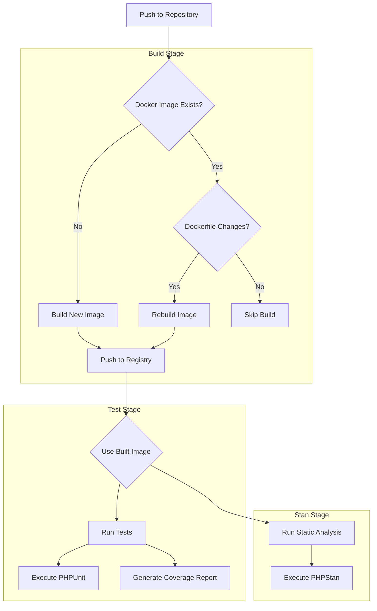

# CI/CD Documentation

## Overview

This project uses GitLab CI/CD for automated testing, code quality checks. The pipeline consists of several stages:
- Build: Creates Docker images
- Stan: Static analysis
- Test: Unit tests with coverage


## Local Development

### Prerequisites

- Docker
- Make
- Git
- Composer

### Setting Up Local Environment

 Install dependencies:
```bash
composer install
```

### Running Tests Locally

Use Make commands to run various tests:

```bash
# Run tests
make test

# Run tests with coverage
make coverage

# Run PHPStan analysis
make phpstan

# Run all tests, coverage, and PHPStan
make all
```

## CI/CD Pipeline Structure

### Templates

#### PHP Job Template
```yaml
.php-job-template:
  cache:
    key:
      files:
        - composer.lock
    paths:
      - vendor/
  tags:
    - docker-aoo
  image: $CI_REGISTRY_IMAGE/test:latest
```
This template provides:
- Dependency caching using composer.lock
- Docker image configuration
- Runner tags

### Jobs

#### Build Image Job
Builds and manages Docker images for testing:
- Checks if image exists
- Rebuilds on Dockerfile changes
- Pushes to GitLab registry

```yaml
build_image:
  stage: build
  services:
    - docker:dind
```

#### Test Job
Runs PHPUnit tests with coverage reporting:
```yaml
test_job:
  stage: test
  script:
    - make test-ci
```

#### Stan Job
Performs static analysis using PHPStan:
```yaml
stan_job:
  stage: stan
  script:
    - make phpstan-ci
```

## Makefile Commands

| Command | Description |
|---------|------------|
| `make test` | Runs PHPUnit tests |
| `make test-ci` | Runs tests with coverage for CI |
| `make phpstan` | Runs PHPStan analysis |
| `make phpstan-ci` | Runs PHPStan for CI environment |
| `make coverage` | Generates coverage report |

## Docker Configuration

The project uses a custom PHP 8.3 image with:
- Composer
- Xdebug for coverage
- Required PHP extensions
- Build tools (git, zip, make)

### Building Docker Image Locally

```bash
docker build -t test-image -f gitlab-ci/Dockerfile.test .
```


## Pipeline Workflow



### Pipeline Stages Explanation

1. **Build Stage**:
   - Checks for existing Docker image
   - Builds or rebuilds based on changes
   - Manages image registry

2. **Test Stage**:
   - Uses built image
   - Runs PHPUnit tests
   - Generates coverage reports

3. **Stan Stage**:
   - Uses same built image
   - Runs PHPStan analysis
   - Reports code quality issues